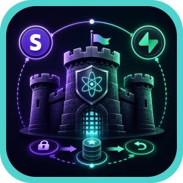
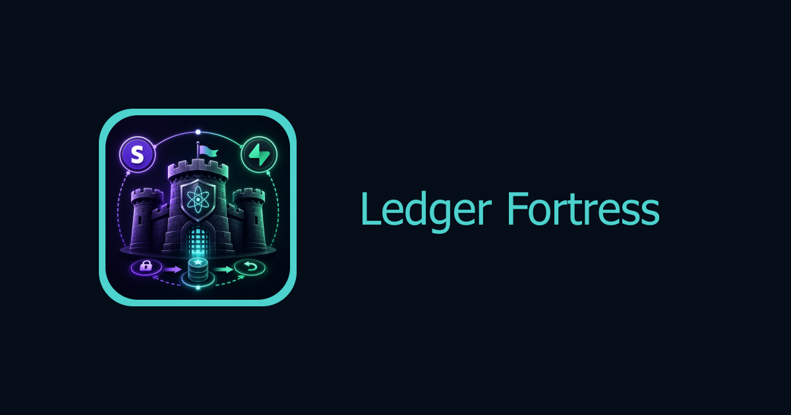

<div align="center">



# Ledger Fortress

Atomic credit settlement engine for async inference workloads.

### Every credit movement is accounted for.

<br />

<strong>Project details</strong>

[](https://babysea.ai/blog/how-babysea-built-atomic-credit-settlement-on-stripe-and-postgres)
[](#babysea-oss-taxonomy)
[](#status)
[](LICENSE)

<br/>

<strong>Checks</strong>

[](https://gitlab.com/babysea/ledger-fortress/-/commits/main)
[](https://codecov.io/github/babysea-community/ledger-fortress)
[](https://github.com/babysea-community/ledger-fortress/actions/workflows/codeql.yml)
[](https://github.com/babysea-community/ledger-fortress/actions/workflows/package-check.yml)

<br/>

<strong>Built with</strong>

[](https://stripe.com)
[](https://supabase.com)

<br/>



</div>

<br/>

## BabySea OSS taxonomy

BabySea open source projects are organized into three categories:

[](#babysea-oss-taxonomy)
[](#babysea-oss-taxonomy)
[](#babysea-oss-taxonomy)

| Category      | Description                                                                                                                                       |
| :------------ | :------------------------------------------------------------------------------------------------------------------------------------------------ |
| **SDK**       | Typed developer entry points for creating, tracking, and managing BabySea workloads from application code.                                        |
| **Primitive** | Reusable infrastructure boundaries extracted from BabySea's execution control plane. Each primitive focuses on one system concern.                |
| **Starter**   | Deployable reference applications that combine product UI, auth, storage, and BabySea execution patterns. Some starters may also include billing. |

## Status

BabySea OSS projects are published into three status levels:

[](#status)
[](#status)
[](#status)

| Status         | Description                                                                                                                                                                          |
| :------------- | :----------------------------------------------------------------------------------------------------------------------------------------------------------------------------------- |
| **Working**    | Fully implemented and deployable. All documented capabilities function as described. Suitable for personal and small-team use. No breaking-change guarantees between versions.       |
| **Production** | Working plus a hardened public runtime contract. Validated against a stated infrastructure stack with deterministic behavior, explicit failure modes, and a documented upgrade path. |
| **Alpha**      | Early-stage implementation. Core structure exists but some capabilities may be incomplete, undocumented, or subject to breaking changes. Not recommended for production deployments. |

See [`CHANGELOG.md`](CHANGELOG.md) to track releases and public contract changes.

## Table of contents

1. [Overview](#1-overview)
    - [What this is](#what-this-is)
    - [Short version](#short-version)
    - [Production lineage](#production-lineage)
    - [Grounding rule](#grounding-rule)
    - [Adoption path](#adoption-path)
2. [Stack contract](#2-stack-contract)
3. [Terminology](#3-terminology)
4. [Boundaries](#4-boundaries)
5. [Architecture](#5-architecture)
6. [Quick start](#6-quick-start)
    - [Apply the migrations](#apply-the-migrations)
    - [Validate against real services](#validate-against-real-services)
    - [Verify security posture](#verify-security-posture)
    - [Use the TypeScript SDK](#use-the-typescript-sdk)
    - [Use the Python SDK](#use-the-python-sdk)
    - [Use the schemas](#use-the-schemas)
7. [Core capabilities](#7-core-capabilities)
    - [Why it's different](#why-its-different)
    - [The credit lifecycle](#the-credit-lifecycle)
    - [The seven edge cases](#the-seven-edge-cases)
    - [Stripe integration](#stripe-integration)
    - [Credit alerts and recovery](#credit-alerts-and-recovery)
    - [Fail-open by design](#fail-open-by-design)
8. [Version surface](#9-version-surface)
9. [Security and Compliance](#10-security-and-compliance)
10. [Community](#11-community)
    - [Who's using it](#whos-using-it)
    - [Related projects](#related-projects)
    - [Contributing](#contributing)
11. [License](#12-license)

---

## 1. Overview

### What this is

`ledger-fortress` is an open-source credit ledger for async inference workloads. It handles additive Stripe grants, atomic pre-dispatch reservations, terminal charge/refund settlement, database-enforced idempotency, low-balance alert state, stale-generation recovery, and backend-only Supabase mutation boundaries.

### Short version

AI generation billing is hard because work is asynchronous. You need to reserve before dispatch, charge on success, refund on failure, survive duplicate webhooks, and recover crashed jobs. `ledger-fortress` packages that lifecycle with Stripe and Supabase.

### Production lineage

The package mirrors the credit-lifecycle invariants BabySea uses for async image and video generation workloads. BabySea-specific tables and names are generalized, but the core pattern remains the same: Stripe grants credits, Supabase is the ledger authority, and every generation has one reservation followed by one terminal settlement.

### Grounding rule

Public OSS behavior is limited to Stripe invoice and checkout grants, Supabase `credits`/`credit_ledger`, reserve-before-dispatch, charge-on-success, refund-on-failure/cancel/cleanup, low-balance alert state, and backend-only mutation access. Refunds, disputes, chargebacks, subscriptions, notifications, and provider execution beyond those implemented helpers remain application-owned.

For the exact split between BabySea-mirrored behavior and OSS-generalized extensions, see [`docs/babysea-provenance.md`](docs/babysea-provenance.md).

### Adoption path

Apply the SQL migrations to Supabase, call the SDK from your backend with a service-role/direct database connection, and wire Stripe webhooks through the included helpers. You bring your app, Stripe account, Supabase project, and generation runtime. The fortress handles the ledger boundary.

## 2. Stack contract

| Layer                       | Required stack               | Runtime responsibility                                                                                         |
| :-------------------------- | :--------------------------- | :------------------------------------------------------------------------------------------------------------- |
| External money movement     | Stripe                       | Send invoice and checkout events, retry webhooks, and report paid amounts.                                      |
| Ledger authority            | Supabase                     | Store balances, immutable ledger entries, plan mappings, RLS, `SECURITY DEFINER` functions, and constraints.    |
| Application runtime         | Backend TypeScript or Python | Call SQL functions through trusted backend credentials; never write ledger tables from browser code.            |
| Customer notification state | Supabase                     | Store low-balance alert settings and deduplication state outside the critical reservation path.                 |
| Recovery runtime            | Backend cron or job runner   | Find and refund orphaned reservations older than the configured window.                                         |

Supabase is the supported production and community ledger authority. PostgreSQL appears only when describing Supabase SQL behavior, PostgreSQL-compatible URLs, `psql` tooling, client libraries, or local developer smoke stand-ins.

## 3. Terminology

| Term                  | Meaning in this package                                                                                                      |
| :-------------------- | :--------------------------------------------------------------------------------------------------------------------------- |
| Credit                | Spendable balance unit. The default convention is `1 credit = $1 USD`, stored as `NUMERIC(10,3)`.                             |
| Additive grant        | Credits from Stripe invoice or checkout events. Grants add to the current balance and never reset rollover credits.           |
| Reservation           | A pre-dispatch atomic deduction by `reserve_credits()` for a generation.                                                      |
| Charge                | A terminal success confirmation. It is log-only unless a prior refund must be corrected.                                      |
| Refund                | A terminal failure, cancel, or crash-recovery reversal of a prior reservation.                                                 |
| Orphaned reservation  | A reservation older than the recovery window with no charge or refund event.                                                  |
| Backend-only boundary | Client roles must not read or write ledger tables directly; trusted app servers call hardened functions.                      |

## 4. Boundaries

- Not a provider router, model catalog, or generation orchestrator.
- Not a client-side balance cache; Supabase is the source of truth.
- Not a generic payment abstraction; Stripe is the implemented reconciliation path.
- Not automatic clawback handling for Stripe refunds, disputes, chargebacks, uncollectible invoices, or support-driven deductions.
- Not BabySea's account, subscription, notification, or provider schema.
- Not a browser SDK. Mutations require backend/service-role access.

## 5. Architecture

```text
Stripe Checkout/Billing
  |  checkout and invoice webhooks
  v
Your backend webhook handler
  |  maps Stripe customer + generation IDs to account IDs
  v
Supabase fortress functions
  |- add_credits(...)       paid grants and renewals
  |- reserve_credits(...)   pre-generation balance gate
  |- charge_credits(...)    terminal success settlement
  `- refund_credits(...)    failed, cancelled, or recovered work
  |
  v
credits balance + immutable credit_ledger
  |
  v
RLS + SECURITY DEFINER backend-only mutation boundary
```

Three pillars keep the invariant small and inspectable:

- **Supabase**: atomic transactions, CHECK constraints, RLS, `SECURITY DEFINER`, unique partial indexes.
- **Stripe**: invoices, one-time checkout sessions, and webhook reconciliation.
- **Exactly-once guarantees**: idempotency keys at the SQL layer, not only application memory.

## 6. Quick start

### Apply the migrations

```bash
git clone https://github.com/babysea-community/ledger-fortress
cd ledger-fortress
psql "$DATABASE_URL" < migrations/001_credits.sql
psql "$DATABASE_URL" < migrations/002_credit_alerts.sql
psql "$DATABASE_URL" < migrations/003_security.sql
```

The migrations create the `credits`, `credit_ledger`, `plans`, `credit_alert_settings`, and `credit_alert_log` tables; thirteen public SQL functions; hardened RLS; client-role denial; and locked `search_path` on mutating functions.

### Validate against real services

Use the non-destructive smoke harness before promoting a deployment:

```bash
python -m venv /tmp/ledger-fortress-smoke-venv
/tmp/ledger-fortress-smoke-venv/bin/pip install "psycopg[binary]>=3.2"
STRIPE_SECRET_KEY="rk_test_..." \
SUPABASE_PROJECT_ID="<project-ref>" \
SUPABASE_DB_PASSWORD="..." \
/tmp/ledger-fortress-smoke-venv/bin/python examples/real-stack-smoke/validate.py
```

See [`examples/real-stack-smoke/`](examples/real-stack-smoke) for required environment variables and cleanup behavior.

### Verify security posture

```bash
DATABASE_URL="postgresql://..." ./scripts/verify-rls.sh
DATABASE_URL="postgresql://..." ./scripts/verify-functions.sh
DATABASE_URL="postgresql://..." ./scripts/verify-anon-denied.sh
```

If direct Supabase IPv6 resolution is unavailable in your runner, use the Supavisor pooler with `SUPABASE_DB_HOST`, `SUPABASE_DB_PORT=6543`, and `SUPABASE_DB_USER=postgres.<project-ref>` when building the database URL.

### Use the TypeScript SDK

Build and install from source until the npm package is published:

```bash
git clone https://github.com/babysea-community/ledger-fortress
cd ledger-fortress/client/typescript
npm install
npm run build

cd /path/to/your-app
npm install /path/to/ledger-fortress/client/typescript
```

```typescript
import { LedgerFortress } from 'ledger-fortress';

const fortress = new LedgerFortress({
  databaseUrl: process.env.SUPABASE_DATABASE_URL ?? process.env.DATABASE_URL!,
});

const reserved = await fortress.reserve({
  accountId,
  generationId,
  amount: 0.062,
  model: 'flux-schnell',
});

if (!reserved) {
  return { error: 'insufficient_credits' };
}

try {
  await runGeneration();
  await fortress.charge({ accountId, generationId, amount: 0.062, model: 'flux-schnell' });
} catch (error) {
  await fortress.refund({ accountId, generationId, amount: 0.062, model: 'flux-schnell' });
  throw error;
}
```

### Use the Python SDK

Install from source until the PyPI package is published:

```bash
git clone https://github.com/babysea-community/ledger-fortress
cd ledger-fortress/client/python
pip install -e .
```

```python
import os

from ledger_fortress import LedgerFortress

fortress = LedgerFortress(
    database_url=os.environ.get("SUPABASE_DATABASE_URL") or os.environ["DATABASE_URL"],
)

reserved = fortress.reserve(
    account_id=account_id,
    generation_id=generation_id,
    amount=0.062,
    model="flux-schnell",
)

if not reserved:
    raise RuntimeError("insufficient_credits")
```

The SDKs expose the same lifecycle: add credits, reserve, charge, refund, list ledger events, and recover orphaned reservations.

### Use the schemas

The JSON schemas in [`schemas/`](schemas) are the event contract. Emit `credit-event.v1.json` events if your own pipeline consumes ledger activity outside the SDK.

## 7. Core capabilities

### Why it's different

Every async AI platform eventually hits the same billing edge cases. `ledger-fortress` pushes those invariants into Supabase transactions and idempotent SQL constraints.

| Problem                                  | How `ledger-fortress` solves it                                                                                       |
| :--------------------------------------- | :-------------------------------------------------------------------------------------------------------------------- |
| **Race conditions.**                     | `reserve_credits()` performs one atomic `UPDATE ... WHERE credits >= cost`; no separate balance read can overdraw.    |
| **Lost credits.**                        | Crash recovery finds old reservations with no terminal event and refunds them idempotently.                           |
| **Duplicate webhooks.**                  | Unique partial indexes prevent duplicate grants, charges, refunds, and reservations.                                  |
| **Out-of-order terminal events.**        | Charge and refund functions inspect prior terminal events and serialize updates with row locks.                       |
| **Credit packs vanish on renewal.**      | `add_credits` is additive and never resets rollover balance.                                                          |
| **Client roles can forge ledger rows.**  | Migration `003_security.sql` enables RLS, revokes client table access, and exposes hardened functions only.           |

### The credit lifecycle

```text
Stripe paid event
  v
add_credits(...)
  v
reserve_credits(...) before dispatch
  v
provider work runs
  v
charge_credits(...) on success
  |
  `-> refund_credits(...) on failure, cancel, or orphan recovery
```

A generation should reserve once and then settle once. Terminal functions require a matching reservation for the same account and generation.

### The seven edge cases

| Edge case                       | What goes wrong                                            | How the fortress handles it                                                                                   |
| :------------------------------ | :--------------------------------------------------------- | :------------------------------------------------------------------------------------------------------------ |
| Two clicks, 50 ms apart          | Both requests see the same balance and overdraw.           | One atomic update checks and deducts in the same statement.                                                    |
| Provider never responds          | Credits stay locked forever.                               | Recovery refunds reservations older than the configured window.                                                |
| Duplicate success webhook        | The app double-charges.                                    | Unique `charge` index makes the second insert a no-op.                                                        |
| Duplicate failure webhook        | The app double-refunds.                                    | Unique `refund` index makes the second insert a no-op.                                                        |
| Charge arrives after refund      | A completed generation could become free.                  | `charge_credits` re-deducts before logging charge or returns `FALSE` for review if collection fails.          |
| Refund arrives after charge      | A successful generation could be refunded.                 | `refund_credits` checks for prior charge and no-ops.                                                          |
| Terminal event without reserve   | App bug tries to settle unreserved work.                   | Terminal functions require a matching `reserve` row.                                                          |

### Stripe integration

`ledger-fortress` includes Stripe webhook helpers with HMAC signature verification. The handler supports `invoice.paid`, `checkout.session.completed`, and `checkout.session.async_payment_succeeded` and can map Stripe customers back to your application account IDs.

By default, grants use the amount Stripe reports as paid (`amount_paid / 100` or `amount_total / 100`) and skip non-positive amounts. Use plan-based resolvers only when your own Stripe Price ID policy intentionally maps to fixed credits in the `plans` table. For the handled/skipped event matrix, see [`docs/stripe-event-matrix.md`](docs/stripe-event-matrix.md).

Stripe refund, dispute, chargeback, and support deduction workflows stay outside this package.

### Credit alerts and recovery

- Low-balance alert settings live in Supabase and deduplicate by threshold descent.
- Alert checks are fire-and-forget and must not block generation responses.
- `recoverOrphans()` finds reservations older than `windowMinutes` with no charge/refund terminal event.
- Recovery is idempotent with the success path, so cron retries are safe.

See [`docs/crash-recovery.md`](docs/crash-recovery.md) and [`docs/edge-cases.md`](docs/edge-cases.md) for implementation details.

### Fail-open by design

| Failure                    | Behavior                                                              |
| :------------------------- | :-------------------------------------------------------------------- |
| Stripe webhook delayed     | Existing credits and reservations keep working; Stripe retries later. |
| Stripe temporarily down    | Existing credits work; new purchases reconcile when Stripe recovers.  |
| Alert delivery fails       | Generation is not blocked; alert state can be checked again later.    |
| Recovery cron misses a run | Orphans wait for the next window.                                     |

The reserve path is intentionally small and synchronous because credits must be gated before dispatch. Everything else is reconciled or recovered around that invariant.

## 8. Version surface

Current version surface:

- [x] Atomic reserve -> charge -> refund lifecycle
- [x] Idempotent Stripe invoice and checkout reconciliation
- [x] Crash recovery for orphaned reservations
- [x] Credit alert state machine
- [x] TypeScript and Python SDKs
- [x] JSON schemas for ledger events
- [x] Supabase migrations with RLS and `SECURITY DEFINER`
- [x] Non-destructive real-stack smoke harness for Stripe and Supabase

New features stay out of the public contract until they are implemented, documented, and validated against this stack.

## 9. Security and Compliance

Ledger Fortress publishes its trust signals through public GitLab and GitHub checks so contributors can inspect the actual CI configuration, jobs, and reports.

## 10. Community

### Who's using it

- **[BabySea](https://babysea.ai)**: execution control plane for generative media.

*Using `ledger-fortress`? Open a PR to add yourself.*

### Contributing

We welcome PRs, issues, and design discussion. See [`CONTRIBUTING.md`](CONTRIBUTING.md), [`CODE_OF_CONDUCT.md`](CODE_OF_CONDUCT.md), and [`SECURITY.md`](SECURITY.md).

## 11. License

[Apache License 2.0](LICENSE). Use it, fork it, ship it.
